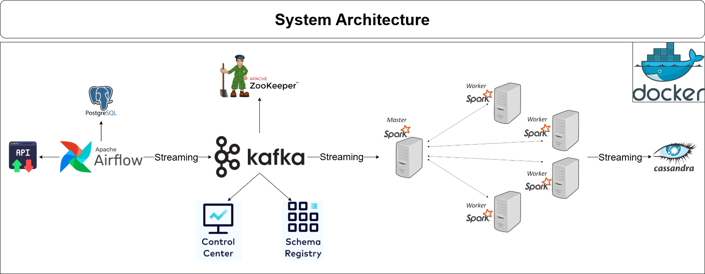
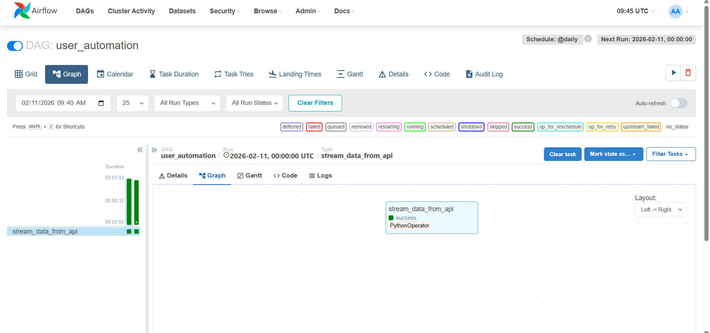
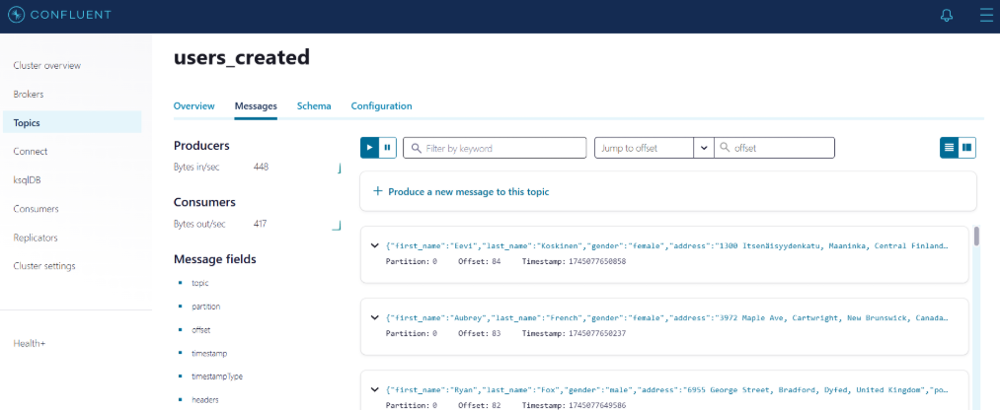
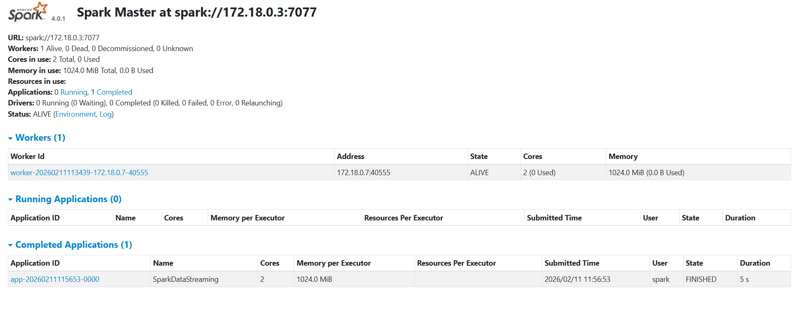

# Realtime Data Streaming | End-to-End Data Engineering Project

Welcome to the **Realtime Data Streaming Pipeline** repository! 🚀  
A scalable data pipeline using **Airflow, Kafka, Spark, and Cassandra**, fully containerized with **Docker**.

---

## 🏗️ System Architecture

The project is designed with the following components:



- **Data Source**: We use `randomuser.me` API to generate random user data for our pipeline.
- **Apache Airflow**: Responsible for orchestrating the pipeline and storing fetched data in a PostgreSQL database.
- **Apache Kafka and Zookeeper**: Used for streaming data from PostgreSQL to the processing engine.
- **Control Center and Schema Registry**: Helps in monitoring and schema management of our Kafka streams.
- **Apache Spark**: For data processing with its master and worker nodes.
- **Cassandra**: Where the processed data will be stored.

---

## 📖 Project Overview

This project serves as a comprehensive guide to building an end-to-end data engineering pipeline. It covers each stage from data ingestion to processing and finally to storage, utilizing a robust tech stack that includes Apache Airflow, Python, Apache Kafka, Apache Zookeeper, Apache Spark, and Cassandra. Everything is containerized using Docker for ease of deployment and scalability.

---

## ⚙️ Tools & Technologies Used

- Apache Airflow
- Python
- Apache Kafka
- Apache Zookeeper
- Apache Spark
- Cassandra
- PostgreSQL
- Docker

---

## 🔧 Tool-wise Section Flow

### 1. 🧑‍💻 Data Source – `randomuser.me` API
- **Purpose:** Generates random user profile data (name, email, location, etc.)
- **Role in Pipeline:** Acts as the real-time external data provider.
- **Trigger:** Called periodically by Apache Airflow to fetch fresh user data.

---

### 2. 🪄 Apache Airflow – Orchestration Layer
- **Purpose:** Automates and schedules the entire pipeline.
- **What It Does:**
  - Schedules DAGs to hit the randomuser.me API.
  - Stores raw data into **PostgreSQL** (temporary staging).
- **Why It’s Important:** Ensures all parts of the pipeline are triggered and executed in the correct sequence.



---

### 3. 🗃️ PostgreSQL – Temporary Staging Storage
- **Purpose:** Temporary storage for raw data fetched by Airflow.
- **What It Does:**
  - Acts as a bridge between ingestion and streaming layers.

---

### 4. 🛰️ Apache Kafka & 🧭 Apache Zookeeper – Streaming Layer
- **Purpose:** Real-time streaming backbone.
- **What It Does:**
  - Kafka streams data from Airflow to Spark.
  - Zookeeper manages and coordinates Kafka brokers.
- **Additional Components:**
  - **Schema Registry:** Manages JSON schemas for message serialization.
  - **Kafka Control Center:** Helps monitor Kafka topics, throughput, consumer lag, etc.



---

### 5. ⚡ Apache Spark – Real-Time Stream Processing
- **Purpose:** Performs structured streaming & transformation.
- **What It Does:**
  - Reads real-time data from Kafka topics.
  - Parses and transforms raw JSON data into a structured format.
  - Pushes cleaned/structured data to Cassandra.
 


---

### 6. 🗄️ Apache Cassandra – Final Storage
- **Purpose:** Distributed NoSQL database for storing processed data.
- **What It Does:**
  - Receives cleaned data from Spark.
  - Provides high availability and scalability for querying processed user profiles.

---

### 7. 🐳 Docker – Containerization
- **Purpose:** Simplifies deployment and scaling.
- **What It Does:**
  - Every component (Airflow, Kafka, Spark, Cassandra, etc.) runs in isolated containers.
  - Ensures reproducibility and easy environment setup.

---

## 🔑 Key Features

- 🔁 **Automated Orchestration :** Scheduled data fetching and streaming via Apache Airflow.
- 📡 **Real-Time Ingestion :** Stream user data in real time using Apache Kafka.
- ⚙️ **Stream Processing :** Live data transformation with Apache Spark Structured Streaming.
- 🗃️ **Scalable Storage :** Persist data in Apache Cassandra, a distributed NoSQL database.
- 🧭 **Monitoring & Schemas :** Manage and track streams with Kafka Control Center & Schema Registry.

---

## 📂 Repository Structure

```
realtime-data-engineering-project/     # Repository Root
│
├── dags/                              # Airflow DAGs
│   └── kafka_stream.py                # Kafka streaming DAG
│
├── docs/                              # Project documentation and architecture details
│   ├── airflow_dag.png
│   ├── data_architecture.png
│   ├── kafka_topic.png
│   └── spark_streaming.png
│
├── script/                            # Helper script for container entrypoint and automation
│   └── entrypoint.sh
│
├── spark_stream.py                    # Spark streaming job
├── docker-compose.yml                 # Docker services configuration
├── requirements.txt                   # Python dependencies
├── .gitignore                         # Files and directories to be ignored by Git
├── LICENSE                            # License information for the repository
└── README.md                          # Project overview and documentation
```

---

## 🛡️ License

This project is licensed under the [MIT License](LICENSE). You are free to use, modify, and share this project with proper attribution.

---

## 🌟 About Me

Hi! I'm **Abdullah Emad**, a **Data Engineer** driven by a core mission: **Transforming raw data into reliable, actionable assets**.

I focus on architecting robust infrastructure that makes data clean, organized, and ready for action. I believe that well-architected data is the backbone of every great decision, and I’m dedicated to implementing best practices to ensure data quality and scalability.

Let’s connect to discuss data, insights, or professional opportunities:

[](https://www.linkedin.com/in/abdullah-emad-abdullah/)
